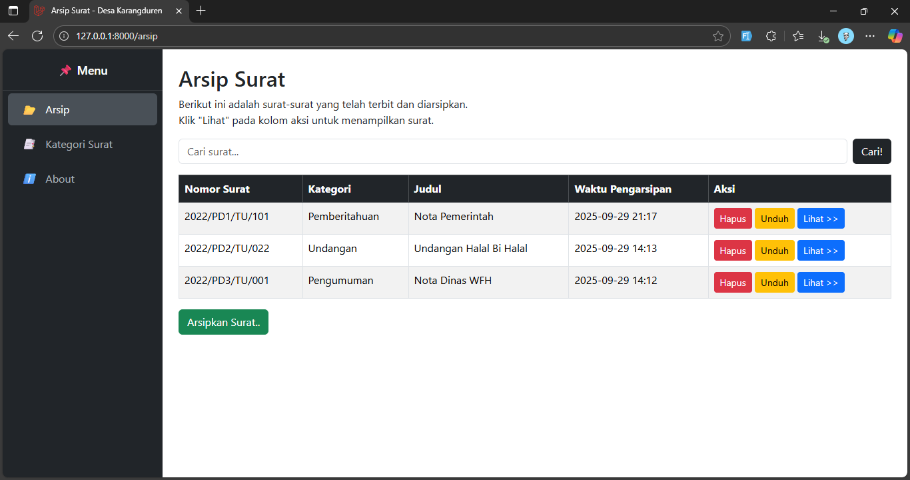
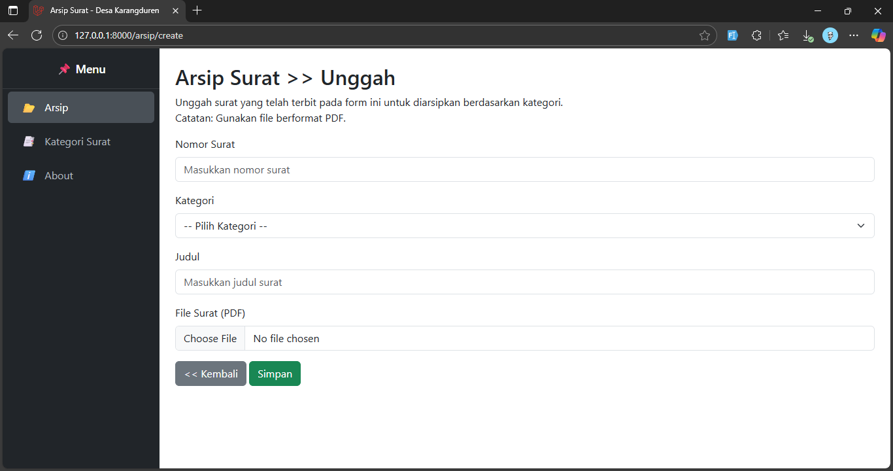
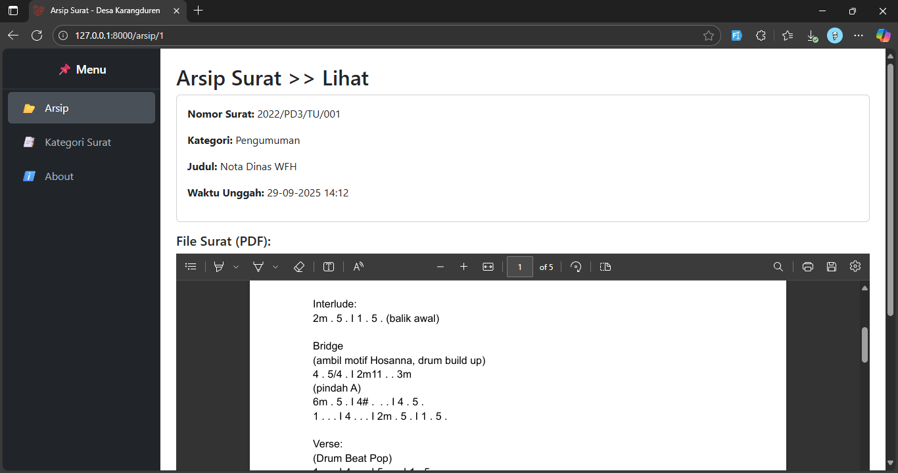
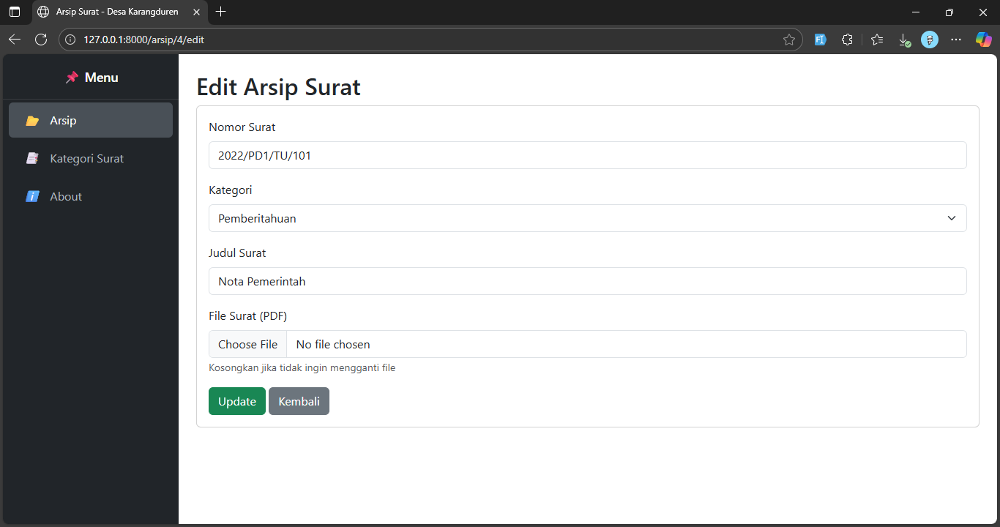
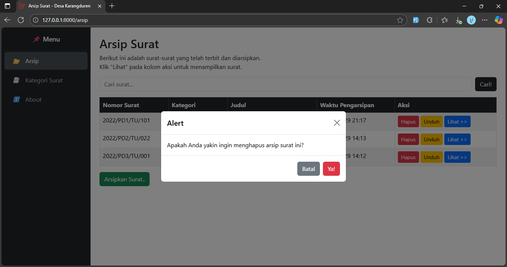
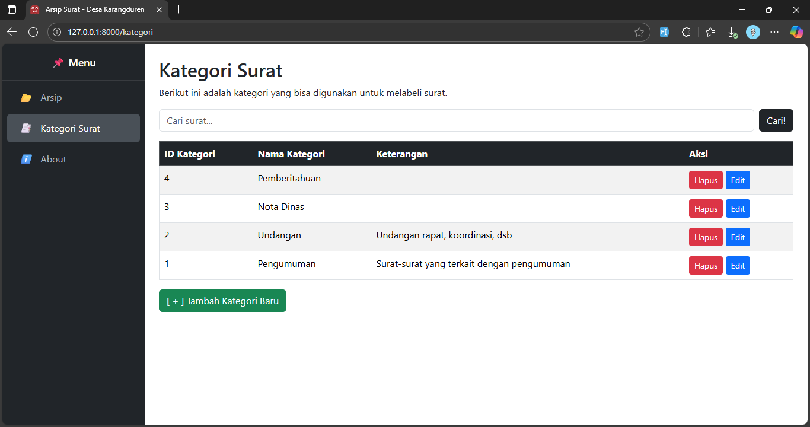
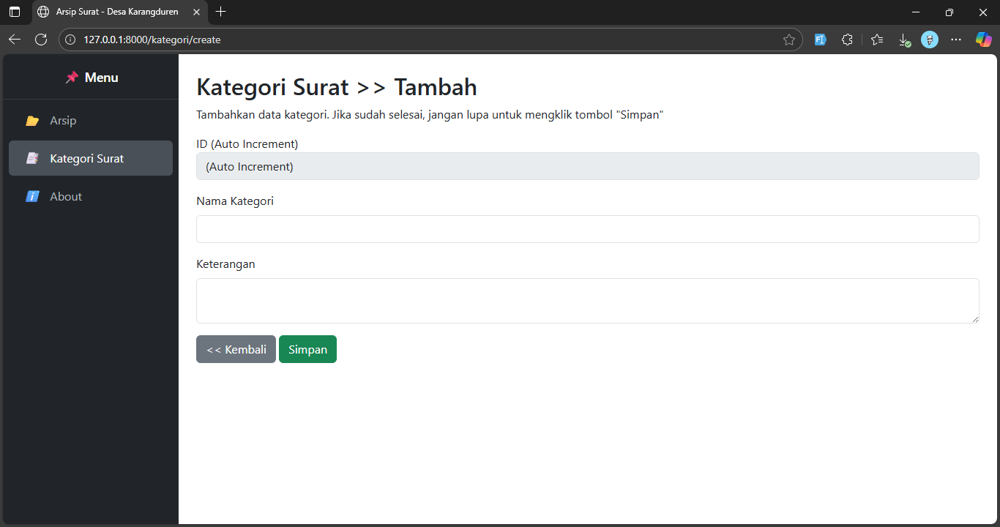
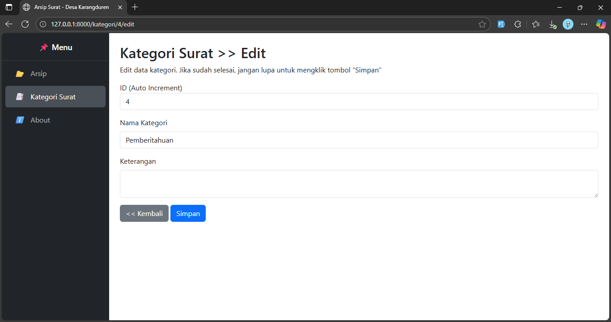
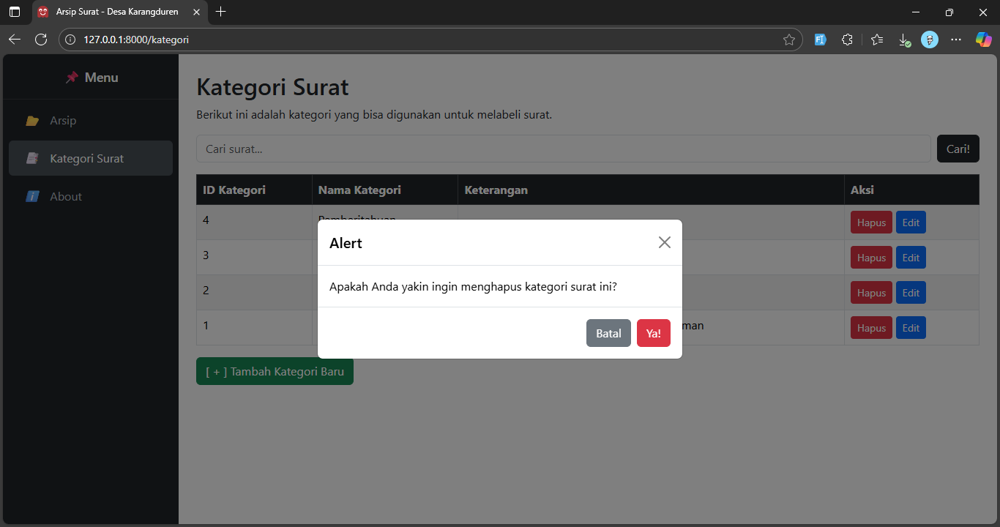
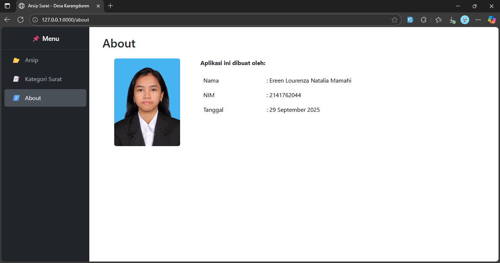

# Sistem Informasi Arsip Surat - Desa Karangduren

## 🎯 Tujuan
Aplikasi ini dibuat untuk mengelola arsip surat masuk dan keluar di Desa Karangduren secara lebih efisien dan terstruktur.

## ✨ Fitur
- CRUD Kategori Surat
- CRUD Arsip Surat
- Upload file surat (PDF)
- Halaman About (identitas pembuat)
- Tanggal unggah otomatis
- Sidebar navigasi

## 🚀 Cara Menjalankan
1. Clone repository:
   ```bash
   git clone https://github.com/ereenlourenza/si_arsipsurat.git
2. Masuk folder project:
   cd si_arsipsurat
3. Install dependencies:
   composer install
   npm install && npm run dev
4. Import database dari file database/si_arsipsurat.sql
5. Konfigurasi .env:
   - database name: si_arsipsurat
   - username: root
   - password: 
   - APP_URL=http://localhost:8000
   - jalankan server: php artisan serve

## 📸 Screenshot









